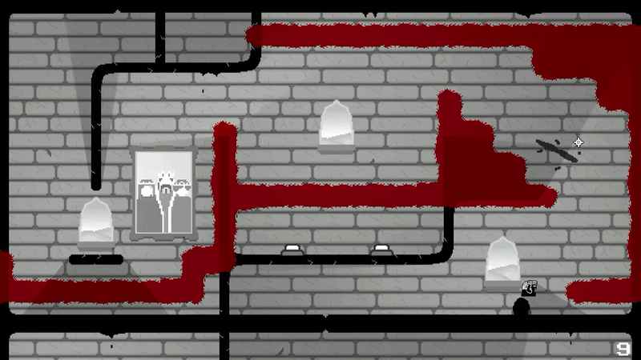

# `ANDRII LAVRINCHUK`

### `JUNIOR GAME DEVELOPER` · `C++ PROGRAMMER`

> **I build systems, mechanics and games.**

`GAMEPLAY` · `SYSTEMS` · `C++` · `GODOT`

📍 Prague, Czech Republic

[📄 CV](CV_LINK) · [📧 Email](mailto:andriilavrinchuk@gmail.com)

---

<div align="center">

## 🎮 `SELECTED WORK`

## [🎮 **Preview of all three selected projects**](BUILD_LINK)

### **[DEALING WITH STUFF](https://github.com/coyzhiv/dealing-with-stuff)**

**A dynamic story-driven JRPG built around fast tactical combat.**

`GODOT` · `GDSCRIPT` · `SOLO PROJECT`

**EXPLORE** → **ENCOUNTER** → **BATTLE** → **STORY** → **REPEAT**


---

### **[ROCKETJUMP GUNSLAUGHTER](https://github.com/coyzhiv/rocketjump)**

**A 2D platformer where your weapon is also your movement system.**

`GODOT` · `GDSCRIPT` · `SOLO PROJECT`

**PLAN** → **PLATFORMING** → **CLEAR** → **REPEAT**



---

### **[CLOSER TO THE SUN](https://github.com/Dahaton/Closer-to-the-sun-R)**

**A fast-paced runner about precision, progression and learning from mistakes.**

`THREE.JS` · `GAME JAM` · `TEAM PROJECT`

**FLY** → **AVOID** → **LEARN** → **UPGRADE** → **REPEAT**

[🌐 **PLAY IN BROWSER**](BUILD_LINK)

</div>

---

## `// WHAT I LIKE TO BUILD`

```text
GAMEPLAY SYSTEMS
        ↓
GAME MECHANICS
        ↓
PLAYER INTERACTION
        ↓
PROGRESSION
        ↓
PLAYABLE EXPERIENCES
```

I enjoy taking a gameplay idea from a rough prototype
to a working system that can actually be played.

My main interests are **gameplay programming, game systems,
mechanics and C++ game development.**

---

## `// TECH STACK`

### Programming

`C++` `C#` `GDScript` `Python`

### Game Development

`Gameplay Programming` · `Game Systems` · `Game Mechanics`
`2D / 3D Development` · `3D Mathematics` · `Debugging` · `Optimization`

### Tools

`Godot` · `Git` · `Visual Studio`

---

## `// CURRENTLY`

🎯 **Focused on:** C++ · Gameplay Programming · Game Systems

🛠️ **Engine:** Godot

📚 **Background:** Software Engineering

🎮 **Goal:** Build better games and become a stronger gameplay programmer.

---

## `// EDUCATION`

**Bachelor of Software Engineering**
National Transport University · 2025

---

<div align="center">

# `LET'S BUILD GAMES.`

**ANDRII LAVRINCHUK**

📍 Prague, Czech Republic

📧 [andriilavrinchuk@gmail.com](mailto:andriilavrinchuk@gmail.com)

</div>
